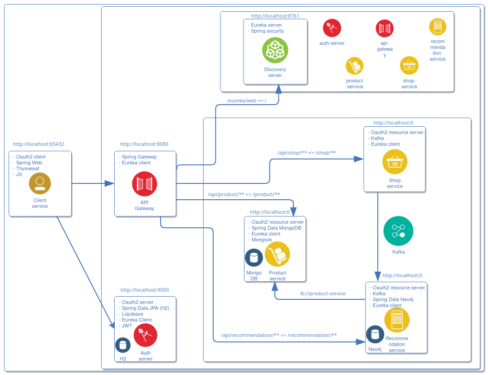

## Репозиторий: recommendation-system
## Группа: spring-2022-08
## ФИО: Ольга Ларина

## Проект "Система рекомендаций продуктов"

### Модули
* [Discovery server Eureka](./discovery-server)
* [Шлюз api gateway](./api-gateway)
* [Авторизационный сервер oauth2](./auth-server)
* [Клиентский сервис](./client-service)
* [Сервис продуктов](./product-service)
* [Сервис магазинов](./shop-service)
* [Сервис рекомендаций](./recommendation-service)

### Docker compose
* [MongoDB, Kafka, Neo4j](./docker-compose.yml)

### Схема
